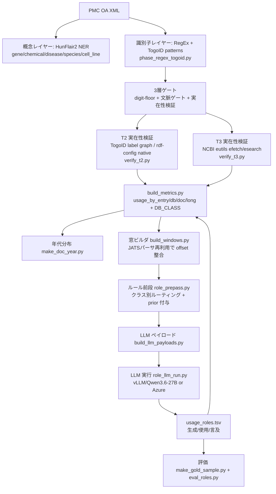

# PMC 全文 データ参照抽出パイプライン — 引き継ぎ記録（Hackathon 向け）

> 目的: PMC 全文から生命科学 DB の識別子を抽出し、**「被寄託データセットへの参照（データ利用・再利用）」**を
> 計測する指標を作る。単なる出現数ではなく、**エントリ単位の実在性検証**と、参照の**役割（生成／使用／言及）**まで判定するのが特徴。
> (SPReAD グラント関連)

最終更新時点のステータス: **実現可能性サブセット（1,000 シャード ≒ 全体の 6.4%、約 17.5k 文献）で一気通貫が完成。**
役割判定まで全文献に適用済み。残りは「ゴールドのラベル付け → 評価集計 → 最終メトリクスへの役割統合」と「全集合（15,649 シャード）へのスケール」。

---

## 1. ポジショニング（なぜ既存と別物か）

- **EuropePMC (EPMC)**: 手法（Kafkas 2013/2015）も出力（FTP TextMinedTerms 54DB 週次、Annotations API）も公開済み。「手法公開／定期更新」は差別化にならない。
- 差別化軸 = **相補カバレッジ（和集合最大）× エントリ単位の実在性検証・名寄せ（TogoID / RDF Portal / SPARQL）× LLM による参照役割判定（生成／使用／言及）× 再現可能な現行実装 × エントリ型細分**。
- 戦略: **EPMC 週次 54DB dump をベースライン入力に取り込み**、その上に EPMC 非対応の ~49 実体 DB＋実在性検証＋役割判定を重ねる非重複構成（「EPMC の焼き直し」批判を封じる）。
- NIH Data Sharing Index (S-index) とは粒度が別で**競合でなく補完**（S-index の「再利用頻度」の証拠基盤を供給）。

相補性の実証: カバレッジ突合（`epmc_togoid_diff.py`）で EPMC 独自 28（EBI 寄託系: PRIDE/MetaboLights/EMPIAR/EMDB/BioStudies/EGA/dbGaP/GWAS/ArrayExpress/AlphaFold）、TogoID 独自 69（モデル生物遺伝子 FlyBase/MGI/RGD/SGD/WormBase/ZFIN/TAIR、オーソログ COG/HomoloGene/OMA、日本発 JGA/NBDC/MBGD/TogoVar/GEA/NANDO 等）。

---

## 2. パイプライン全体像



### ステージ要約
1. **抽出**: 概念レイヤー（HunFlair2）＋識別子レイヤー（RegEx→TogoID パターン）。全文は JATS XML を `preprocess.py` の `JATSParser` でその場パース（本文は永続化しない）。
2. **ゲート**: 3層 = ① digit-floor（`rs\d{4,}` 等の桁下限）② 文脈ゲート（PDB 等）③ 実在性検証。**重要な負の結果**: identifiers.org の登録パターンは抽出には使えない（検証用であって、観測された偽陽性 21 件は全部そのパターンを通過する）。
3. **実在性検証**: **T2**（TogoID label graph の `dcterm:identifier` を VALUES 照合＝per-DB 設定ゼロ、無ければ rdf-config native URI）→ **T3**（NCBI eutils で権威 DB を確定、absent 主張可）。status は confirmed/pending/absent。
4. **集計**: `build_metrics.py` が confirmed のみ集計、DB_CLASS（下記）でクラス別文献率。
5. **年代分布**: `make_doc_year.py`（oa_file_list の Article Citation から年抽出）。
6. **役割判定**: (a) ルール前段 → (b1) ペイロード → (b2) LLM。詳細は §4。
7. **評価**: 層化ゴールド → 混同行列・P/R/F1・キャリブレーション。

### DB クラス分類（credit 軸、`build_metrics` の `DB_CLASS`）
- `deposited_research_record`: geo_series/geo_sample/sra_*/assembly_insdc — **寄託データ本体**（生成／使用が意味を持つ本丸）
- `deposited_entity_registry`: glytoucan
- `curated_entity_registry`: hgnc/chebi/omim_gene/mirbase/lipidmaps …
- `derived_curated`: refseq系/uniprot系/ensembl系/pfam/interpro/cog/reactome/tair/flybase系 … — 参照資源
- `out_of_scope`: go/ec/pubmed/pmc/affy_probeset/inchi_key … — 対象外

---

## 3. 主要な実測結果（実現可能性サブセット: shard 0:1000）

- 処理文献 **17,571**、全データ参照文献率 **93.27%**（16,389 文献）、confirmed 参照 **78,515**、ユニーク実在エントリ **44,536**。
- 93% は「データ実体に触れる広さ」で大半が reference 系。**寄託（deposit）参照率は別で 6–7%**（＝指標は二層構造: 広がり＝主要 DB が決定 / 深さ・多様性＝拡張 DB）。
- **年代バイアス（重要な注意）**: 若番シャード＝古い論文に偏る（1994–2012・中央値 2009）。寄託系文献率 29.36% は「データ公開が一般化する 2010 年代後半以前の**下限値**」。標本内トレンドでは 2007 寄託 33% → 2011 寄託 67% と上昇を捕捉 → バイアスを「母集団では上振れ」の定量根拠に転換。
- **役割分布（全サブセット `usage_roles_all` の LLM 判定 12,135 の内訳）**: deposit generated **5,147** / used **3,707** / mentioned 137（寄託系は自データ生成と他データ再利用がほぼ拮抗・生成やや優勢）。derived used 2,632 / mentioned 501。→ 最終指標「生成 vs 使用 vs 参照資源利用」の内訳が実データで見えた。

---

## 4. 役割判定サブシステム（本 Hackathon の最新成果）

**定義**: generated（この論文が産出・寄託）／used（既存データ・参照資源を入力として使用）／mentioned（産出も使用もせず名指し・例示・BLAST ヒット等）。

- **文脈窓**: `build_windows.py`。本文ストアは無いので confirmed 文献の OA XML を**同じ JATSParser で再パース**（→ offset/passage_idx がバイト一致で再現＝整合が構成上保証）。窓は案A（1エンティティ1行）、`«»` でマーキング、列挙は導入節＋局所項目、自己アライメント検証つき。
- **ルール前段**: `role_prepass.py`（LLM 非依存）。クラス別ルーティング:
  - out_of_scope → skip
  - deposit 系 → 3値フル・**全件 LLM**（ルールは prior=事前情報のみ、最終は本文優先）
  - derived/curated → 2値（使用/言及）でルール即決優先、曖昧のみ LLM
  - ルール: DOMAIN_FAMILY_DBS（cog/pfam/interpro…）→ mentioned、REF_USE（aligned to / using the … genome / as query 等に限定）→ used、他 → mentioned
  - 実測: rule_final **88.6%**（derived は 94%）。
- **LLM**: `build_llm_payloads.py`（バックエンド中立ペイロード）→ `role_llm_run.py`（OpenAI 互換 = vLLM/Ollama、または Azure）。構造化 JSON を guided/schema で強制。**弱い prior を本文で上書きする挙動を実データで実証**（例: NM_005749 が prior=use → LLM で mentioned）。
- **評価**: `make_gold_sample.py`（層化・モデル出力を伏せた `gold_todo.tsv` ＋照合用 `gold_key.tsv`）→ `eval_roles.py`（混同行列・P/R/F1・rule/LLM 別精度・信頼度ビン別・ref_resource 分離）。**現在ゴールド 221 件を抽出済み、ラベル付け待ち。**

### 実行環境（役割判定 LLM）
- ハード: NVIDIA L40S 46GB ×2。モデル: **`Qwen/Qwen3.6-27B-FP8`**（公式 FP8、1枚に載る → データ並列2本）。
- vLLM 注意点: **非思考モード**（`chat_template_kwargs={"enable_thinking":false}`）+ `--trust-remote-code`、**temperature≠0**（Qwen3 系は temp=0 でループ）、**`--max-model-len 16384`**（accession 密な窓は token 密度が高く 8192 では溢れる）。
- OSS 優先・不調時 Azure OpenAI にフォールバック（同一ペイロードで `--backend azure`）。

---

## 5. 引き継ぎで効く「落とし穴」集

- **identifiers.org パターンは抽出器にできない**（検証専用）。抽出には桁下限＋文脈＋実在性検証の3層で。
- **実在性は文字列パターンだけでは決まらない** → T2/T3 の実在性検証が本質。
- **JATSParser を自前パースで置き換えない**（offset がずれて役割判定の窓が壊れる）。同じパーサ・同じフラグ（`include_captions=True, include_tables_text=False`）を使う。
- **parquet ディレクトリの `*.parquet.done`（0byte 完了マーカー）**を読むと落ちる → `glob("*.parquet")` かつ size>0 で明示指定。
- **b1 を直したらペイロード再生成**（中立化前後で `system_text` 不在の KeyError）。
- **refseq の貪欲マッチ誤爆**は桁制約（6桁 or 9桁＋版）で恒久修正済み。
- **参照資源利用（aligned to RefSeq 等）は「被寄託データ再利用」と別物** → `note=ref_resource` で分離集計。この定義を最終メトリクスで明示する。

---

## 6. 再現手順（要点コマンド）

```bash
# 識別子抽出（CPU, 全shard=0:15649）
python -m pmc_annotator.phase_regex_togoid run --plan ./data/oa/phase1/shard_plan.json \
  --output <out> --patterns src/pmc_annotator/data/togoid_patterns_recall.yaml \
  --global-range 0:1000 --workers 64
# 実在性検証 T2/T3 → build_metrics → 年代分布
# 役割判定:
python -m pmc_annotator.build_windows  --usage metrics/usage_long.tsv \
  --parquet-dir ./data/oa/phase_regex_togoid_v5/accession_annotations_togoid \
  --xml-root ~/PMC_xml --out windows_all.jsonl
python -m pmc_annotator.role_prepass       --windows windows_all.jsonl --out role_prelim_all.tsv
python -m pmc_annotator.build_llm_payloads --prelim role_prelim_all.tsv --windows windows_all.jsonl \
  --out llm_payloads_all.jsonl --max-entities-per-doc 15
# vLLM を 2本立て（各GPU, --max-model-len 16384）で起動しておく
python -m pmc_annotator.role_llm_run  --payloads llm_payloads_all.jsonl --prelim role_prelim_all.tsv \
  --out usage_roles_all.tsv --backend oss \
  --base-url http://localhost:8001 --base-url http://localhost:8002 \
  --model qwen3.6-27b --json-mode schema --concurrency 24
# 評価
python -m pmc_annotator.make_gold_sample --usage-roles usage_roles_all.tsv --windows windows_all.jsonl \
  --n 300 --min-per-cell 20 --cap-per-cell 60
python -m pmc_annotator.eval_roles --todo gold_todo.tsv --key gold_key.tsv
```

OA XML の配置: `PMC_xml/PMC{高位3桁}xxxxxx/{doc_id}.xml`（`bucket = f"PMC{int(doc_id[3:])//1_000_000:03d}xxxxxx"` で直接算出）。

---

## 7. Hackathon の入口タスク候補
- **全集合スケール**: 6.4%（1,000 シャード）→ 15,649 シャード。年代バイアスの解消と寄託系文献率の本推定。
- **抽出の穴埋め**: 寄託 recall のボトルネックは **ENA + PDB**（現状 recall 0.3% の 98.4% がこの2つの未実装）。抽出器追加＋既実装の PDB 文脈ゲートの検証。
- **EPMC ベースライン統合**: TextMinedTerms 54DB dump を入力に取り込む非重複マージ。
- **実在性検証の拡張**: pending 上位 DB（affy_probeset 等）の T2/T3 ルート追加。
- **役割判定の評価・改良**: ゴールドのラベル付け → `eval_roles` → 生成⇄使用が弱ければプロンプト/モデル調整、confidence の閾値ルーティング。

---

# 公開リソース一覧（GitHub リポジトリ）

## A. コード（`src/pmc_annotator/`）
| モジュール | 役割 |
|---|---|
| `preprocess.py` | JATSParser（JATS XML → passage、offset 保持）。**全段で共有・改変厳禁** |
| `phase1_ner.py` | 概念レイヤー（HunFlair2 NER） |
| `phase_regex.py` / `phase_regex_togoid.py` | 識別子レイヤー（RegEx / TogoID パターン版） |
| `pipeline.py` | フェーズ統合エントリ |
| `build_togoid_patterns.py` | TogoID パターン生成（`RECALL_MODE`, `split_flybase`） |
| `digit_floor_gate.py` | Layer-1 桁下限ゲート |
| `verify_t2.py` / `rdfconfig_to_registry.py` | T2 実在性検証（TogoID label graph / rdf-config native）＋レジストリ生成 |
| `verify_t3.py` / `build_candidates.py` | T3 実在性検証（NCBI eutils）＋候補生成 |
| `build_metrics.py` | 最終集計（usage_by_entry/db/doc/long, DB_CLASS） |
| `make_doc_year.py` | 発行年抽出・年代分布 |
| `build_windows.py` | 役割判定の文脈窓ビルダ |
| `role_prepass.py` | ルール前段＋クラスルーター |
| `build_llm_payloads.py` | LLM ペイロード（バックエンド中立） |
| `role_llm_run.py` | LLM 実行（vLLM/Ollama/Azure） |
| `make_gold_sample.py` / `eval_roles.py` | 層化ゴールド抽出／評価集計 |
| `scoped_eval.py` / `epmc_togoid_diff.py` | Data Citation Corpus 突合／EPMC カバレッジ突合 |

## B. 設定・辞書
- `data/togoid_patterns_recall.yaml`（高 recall 候補パターン, ~98種）／`data/togoid_extract_patterns.yaml`（既定出力）
- DB_CLASS 分類マップ、T3_ROUTE 設定、REF_USE/DOMAIN_FAMILY_DBS など役割ルール定義
- 役割判定ルーブリック（`build_llm_payloads.py` 内 `RUBRIC`）

## C. 検証レジストリ（生成物・再現可能）
- `t2_registry.json`（rdf-config 由来, queryable=69）／`t2b_coverage.json`（TogoID label graph カバレッジ）

## D. 出力スキーマ＋小サンプル（データ本体は非公開、スキーマと数行のサンプルのみ）
- `usage_by_entry/db/doc/long.tsv`, `usage_by_class.tsv`, `usage_by_year.tsv`
- `usage_roles*.tsv`（役割付き）, `windows*.jsonl`（窓）
- `gold_todo.tsv` / `gold_key.tsv`（ラベル完了後にゴールドセットとして公開）

## E. ドキュメント
- 本 `HANDOFF.md`、`README.md`、パイプライン図（上記 mermaid）
- `feasibility_memo.md`（実現可能性メモ, 2026-07-09）
- 「prefix 関係マップ」（各エンティティ型の RDF Portal native URI / TogoID prefix / identifiers.org / 異名の対応表）※ Google スプレッドシートへのリンク

## F. 外部依存・出典（README に明記）
- TogoID / rdf-config（dbcls）/ RDF Portal SPARQL、HunFlair2、NCBI E-utilities、EuropePMC（TextMinedTerms / Data Citation Corpus）、Qwen3.6-27B-FP8、vLLM。各ライセンス・引用を記載。

## G. 公開しない / 注意
- **API キー**（`NCBI_API_KEY`, Azure 資格情報）、`t3_cache.sqlite`（キャッシュ）
- **全集合の大規模出力**（7.82M 文献規模）・OA XML 本体（PMC OA から再取得可能なので配布不要）
- 個人が特定できるトークン類は含めない
