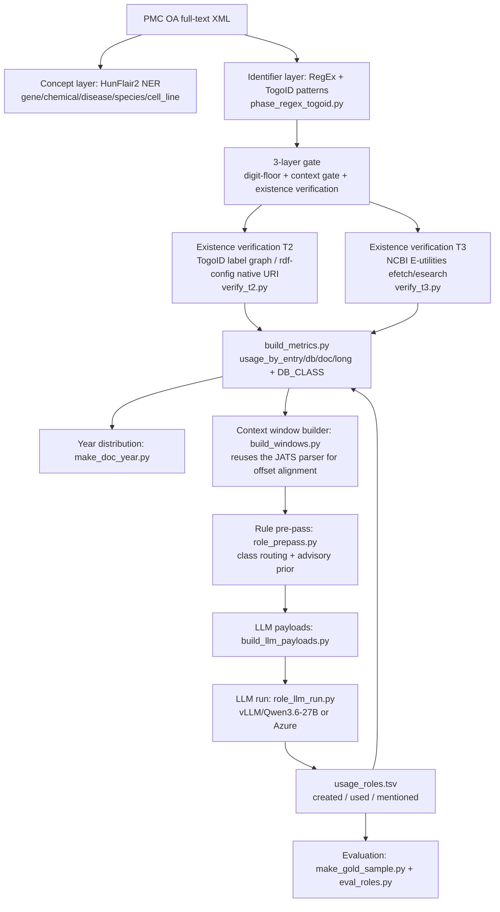

# Measuring Data Reuse from PMC Full Text — Project Introduction

*Prepared for colleagues in the Identifiers.org / EMBL-EBI group who are new to this project.*

You know our group through the **TogoID × Identifiers.org registry-reconciliation** work. This is a
**downstream application of that identifier layer**: we mine PMC full text for life-science database
accessions and turn them into a **data-usage / data-reuse metric** — not just "how often is an accession
mentioned," but **does the referenced entry actually exist**, and **what role does the reference play**
(the paper *created/deposited* the data, *used/reused* existing data, or merely *mentioned* it).

---

## 1. TL;DR

- **Input:** PubMed Central Open Access (PMC OA) full-text XML.
- **Extract:** database identifiers (GEO, SRA, RefSeq, UniProt, PDB, TogoID-covered resources, …) with a
  concept layer (NER) and an identifier layer (regex + TogoID patterns).
- **Verify existence** of each candidate entry against authoritative sources (TogoID label graphs /
  RDF Portal SPARQL, and NCBI E-utilities) — this is the part closest to your world, and complementary
  to *resolution*.
- **Classify the reference role** (created / used / mentioned) with a rule pre-pass + a local LLM.
- **Output:** per-entry / per-DB / per-document / per-year usage metrics, split by role and by a
  credit-oriented DB class.
- **Status:** end-to-end on a **feasibility subset (~6.4% of the corpus, ~17.5k papers)**. Full-corpus
  scale-up and the final human evaluation of the role classifier are the open work — good hackathon targets.

---

## 2. How this connects to Identifiers.org

- **CURIEs and prefixes everywhere.** Extracted identifiers are carried as CURIEs (`db:localid`). The
  bridge between **TogoID prefixes ↔ Identifiers.org prefixes ↔ RDF Portal native URI namespaces** is
  maintained as a "prefix relation map" (a lookup table). Reconciling these namespaces is exactly the
  shared-interest surface between our groups.
- **Resolution vs. existence verification (complementary, not overlapping).** Identifiers.org answers
  *"given a valid CURIE, where does it resolve?"* This project answers a different question:
  *"does this token, found in running prose, correspond to an entry that actually exists at the source?"*
  We call that **existence verification** (details in §4). Resolution and existence verification compose
  well — a resolvable prefix plus a verified local entry is a stronger provenance signal than either alone.
- **A finding worth sharing.** We tested whether **registry
  validation patterns could be reused as *extraction* patterns** over free text. They cannot on their own:
  every one of 21 audited false positives *passed the official syntax patterns*. This is expected and not a
  defect — a validation pattern answers *"is this a syntactically well-formed X accession?"*, whereas
  extraction from prose additionally needs *"is this substring, in this context, actually an X accession?"*.
  It motivated our **3-layer extraction gate** (§4). If useful, this is exactly the kind of empirical input
  that could feed back into extraction guidance around the registry.
- **EBI-hosted deposit resources are our biggest recall gap.** Our deposit-side recall is currently
  bottlenecked by **ENA and PDB** (≈98% of misses), and the resources that EuropePMC extracts but we don't
  are largely **EBI deposition databases** (PRIDE, MetaboLights, EMPIAR, EMDB, BioStudies, EGA, ArrayExpress,
  AlphaFold).

---

## 3. Positioning (vs. EuropePMC, NIH S-index)

- **EuropePMC (EPMC):** its method (Kafkas 2013/2015) and outputs (FTP `TextMinedTerms`, 54 DBs, weekly;
  Annotations API) are public, so "we publish a method / update regularly" is *not* a differentiator.
- **Our differentiation:** *complementary coverage (maximize the union) × entry-level existence verification
  and name-mapping (TogoID / RDF Portal / SPARQL) × LLM reference-role classification (created/used/mentioned)
  × a reproducible current implementation × entry-type granularity.*
- **Strategy:** ingest the EPMC weekly `TextMinedTerms` dump as a **baseline input**, and layer on top the
  ~49 EPMC-uncovered entity DBs + existence verification + role classification (a non-overlapping build, so
  it can't be dismissed as "re-doing EPMC").
- **NIH Data Sharing Index (S-index):** different granularity (per-researcher) — **complementary**, not a
  competitor; we can supply the evidence base for its "reuse frequency" signal.

Coverage was quantified with `epmc_togoid_diff.py`: EPMC-unique DBs are EBI depositions (above); TogoID-unique
DBs are model-organism gene resources (FlyBase/MGI/RGD/SGD/WormBase/ZFIN/TAIR), orthology (COG/HomoloGene/OMA),
and Japan-origin resources (JGA/NBDC/MBGD/TogoVar/GEA/NANDO).

---

## 4. Pipeline

**Stage notes**
1. **Extraction.** Concept layer = HunFlair2 (a biomedical NER model, 5 entity types). Identifier layer =
   regex patterns generated from TogoID mappings. Full text is parsed on the fly from JATS XML by a single
   shared parser (`preprocess.py`); passage text is *not* persisted (only offsets are).
2. **3-layer gate.** ① digit-floor (e.g. `rs\d{4,}`, `SAM[NED]\d{8,}`) ② context gate (e.g. PDB requires a
   nearby PDB cue + a year guard) ③ existence verification. Rejects the free-text false positives that pure
   syntax patterns admit.
3. **Existence verification.**
   - **T2** — resolve against **TogoID label graphs** (`dcterm:identifier` matched via SPARQL `VALUES`,
     zero per-DB configuration); fall back to **rdf-config native URIs** for DBs without a label graph.
   - **T3** — confirm authoritative DBs via **NCBI E-utilities** (RefSeq/GEO), which can assert *absence*.
   - Status is `confirmed` / `pending` / `absent` (we never assert absence from T2 alone).
4. **Metrics.** `build_metrics.py` aggregates only `confirmed` entries, grouped by a credit-oriented DB class.
5. **Role classification.** Rule pre-pass + local LLM (§6).

**DB class (credit axis)** — `deposited_research_record` (GEO/SRA/assembly — the deposit core where
created-vs-used matters most), `deposited_entity_registry` (GlyTouCan), `curated_entity_registry`
(HGNC/ChEBI/miRBase…), `derived_curated` (RefSeq/UniProt/Ensembl/Pfam/COG/TAIR… — reference resources),
`out_of_scope` (GO/EC/PubMed/probeset…).

---

## 5. Key results (feasibility subset: 1,000 shards ≈ 6.4%)

- Papers processed **17,571**; any-data-reference rate **93.3%** (16,389 papers); confirmed references
  **78,515**; unique verified entries **44,536**.
- The 93% is "breadth of touching data entities" and is mostly reference resources. The **deposit-reference
  rate is separate, ~6–7%** — the metric is genuinely two-layer (breadth is set by a few major DBs; depth /
  diversity comes from the long tail).
- **Temporal-bias caveat (important).** The subset is skewed to *older* papers (median year 2009, none after
  2012) because shard order follows PMC-ID order. So the deposit-reference rate (~29% of deposit-class papers)
  is a **lower bound** relative to the post-2015 norm. Within-subset trend already shows deposition rising
  (2007 → 2011), which we use to argue the population figure is an *upward* revision.
- **Role distribution** (of 12,135 LLM-decided references across the subset): deposit **created 5,147 /
  used 3,707 / mentioned 137** (creation and reuse are roughly balanced, creation slightly ahead);
  derived **used 2,632 / mentioned 501**. This is the "created vs. used vs. reference-resource-use" breakdown
  emerging from real data.

---

## 6. Reference-role classifier (the most recent work)

**Roles:** `created` (this paper produced/deposited the data), `used` (existing data or a reference resource
taken as input), `mentioned` (named/exemplified/BLAST-hit — neither produced nor consumed).

- **Context windows** (`build_windows.py`): since passage text isn't persisted, we re-parse each paper's OA XML
  with the *same* JATS parser, which reproduces byte-identical offsets so the extracted spans stay aligned.
  The target accession is marked with `«…»`.
- **Rule pre-pass** (`role_prepass.py`, no LLM): routes by DB class. Deposit classes → full 3-way, all sent to
  the LLM (rules only supply an *advisory prior*). Reference/curated classes → 2-way (used/mentioned) decided
  by rules where unambiguous, LLM only for the residue. ~89% of references are rule-final.
- **LLM** (`build_llm_payloads.py` → `role_llm_run.py`): backend-neutral payloads run against an
  OpenAI-compatible server (local vLLM, or Azure OpenAI as fallback), with schema-constrained JSON output.
  A nice property we verified: the model **overrides a weak rule prior from the text** (e.g. an accession that
  merely *names* a gene is correctly labeled `mentioned` even when a nearby verb suggested `used`).
- **Evaluation** (`make_gold_sample.py` / `eval_roles.py`): stratified gold set with model output hidden from
  the labeler; reports a 3×3 confusion matrix, per-role P/R/F1, rule-vs-LLM accuracy, and confidence
  calibration. **Currently: 221-item gold set drawn, awaiting human labels.**

**Serving note (for anyone reproducing):** 2× NVIDIA L40S (46 GB). Model `Qwen/Qwen3.6-27B-FP8`, one replica
per GPU (data-parallel). vLLM must run with **thinking disabled** (`chat_template_kwargs.enable_thinking=false`,
`--trust-remote-code`), **temperature ≠ 0** (Qwen3 loops at 0), and **`--max-model-len 16384`** (accession-dense
windows tokenize far above a chars/4 estimate and overflow 8192).

---

## 7. Status & where you could plug in (hackathon)

**Done:** extraction, existence verification (T2/T3), metrics, year distribution, and the full role-classifier
pipeline applied across the feasibility subset. **Open:** gold labeling → evaluation → folding roles back into
the metrics; and scaling from 6.4% to the full 15,649 shards.

Entry points, several touching your expertise:
- **EBI-deposit extractors (highest impact).** Add ENA + PDB recall and the EPMC-unique EBI resources
  (PRIDE/MetaboLights/EMPIAR/EMDB/BioStudies/EGA/ArrayExpress/AlphaFold). You know these accession formats best.
- **Prefix / CURIE reconciliation.** Extend and formalize the TogoID ↔ Identifiers.org ↔ RDF Portal prefix map;
  drive extraction and verification off a shared registry.
- **Resolution-backed verification.** Prototype using Identifiers.org resolution as an additional verification
  route alongside T2/T3.
- **EPMC baseline integration** (ingest `TextMinedTerms` as input), and **T2/T3 routes for pending DBs**.
- **Full-corpus scale-up** and the temporal-bias-corrected population estimate.

---

## 8. Repository resources (proposed public set)

### A. Code (`src/pmc_annotator/`)
| Module | Purpose |
|---|---|
| `preprocess.py` | JATS parser (XML → passages, offset-preserving). **Shared by all stages; do not fork.** |
| `phase1_ner.py` | Concept layer (HunFlair2 NER) |
| `phase_regex.py` / `phase_regex_togoid.py` | Identifier layer (regex / TogoID-pattern variant) |
| `pipeline.py` | Phase orchestration entry point |
| `build_togoid_patterns.py` | TogoID pattern generation (`RECALL_MODE`, `split_flybase`) |
| `digit_floor_gate.py` | Layer-1 digit-floor gate |
| `verify_t2.py` / `rdfconfig_to_registry.py` | T2 existence verification + registry build |
| `verify_t3.py` / `build_candidates.py` | T3 existence verification (NCBI) + candidate build |
| `build_metrics.py` | Final aggregation (usage_by_entry/db/doc/long, DB_CLASS) |
| `make_doc_year.py` | Publication-year extraction / year distribution |
| `build_windows.py` | Context-window builder for role classification |
| `role_prepass.py` | Rule pre-pass + class router |
| `build_llm_payloads.py` | LLM payloads (backend-neutral) |
| `role_llm_run.py` | LLM runner (vLLM/Ollama/Azure) |
| `make_gold_sample.py` / `eval_roles.py` | Stratified gold sampling / evaluation |
| `scoped_eval.py` / `epmc_togoid_diff.py` | Data Citation Corpus eval / EPMC coverage diff |

### B. Configuration & dictionaries
- `data/togoid_patterns_recall.yaml` (high-recall patterns, ~98 DBs); default `togoid_extract_patterns.yaml`
- DB_CLASS map, T3 route config, role rules (`REF_USE`, `DOMAIN_FAMILY_DBS`), and the role-classifier rubric.

### C. Verification registries (generated, reproducible)
- `t2_registry.json` (from rdf-config, queryable ≈ 69), `t2b_coverage.json` (TogoID label-graph coverage).

### D. Output schemas + small samples (schema + a few rows; **not** the bulk data)
- `usage_by_entry/db/doc/long.tsv`, `usage_by_class.tsv`, `usage_by_year.tsv`
- `usage_roles*.tsv` (role-annotated), `windows*.jsonl`
- `gold_todo.tsv` / `gold_key.tsv` (publish the labeled gold set once complete).

### E. Documentation
- This intro, a `README.md`, the pipeline diagram (mermaid above)
- `feasibility_memo.md`
- The **prefix relation map** (TogoID prefix / RDF Portal native URI / Identifiers.org / aliases) — link.

### F. External dependencies & attribution (state in README)
- TogoID, rdf-config (DBCLS), RDF Portal SPARQL, HunFlair2, NCBI E-utilities, EuropePMC
  (`TextMinedTerms` / Data Citation Corpus), Qwen3.6-27B-FP8, vLLM — with licenses / citations.

### G. **Not** published
- API keys (`NCBI_API_KEY`, Azure credentials), caches (`t3_cache.sqlite`)
- Full-corpus outputs and OA XML (re-fetchable from PMC OA).

---

## Glossary
- **PMC OA** — PubMed Central Open Access subset (full-text XML, redistributable).
- **TogoID / RDF Portal** — DBCLS (Japan) identifier-conversion service and SPARQL data portal.
- **HunFlair2** — biomedical NER model (concept layer).
- **CURIE** — compact URI, `prefix:localid`.
- **T2 / T3** — our two existence-verification tiers (SPARQL-based / NCBI-E-utilities-based).
- **DB_CLASS** — credit-oriented database classification (deposit vs. curated vs. derived vs. out-of-scope).
- **shard** — a processing partition of the corpus; the full corpus is 15,649 shards (7.82M papers); the
  feasibility run used shards 0–999.
